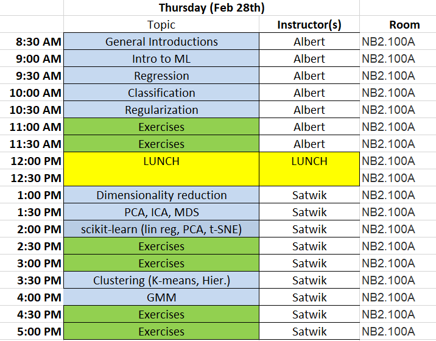
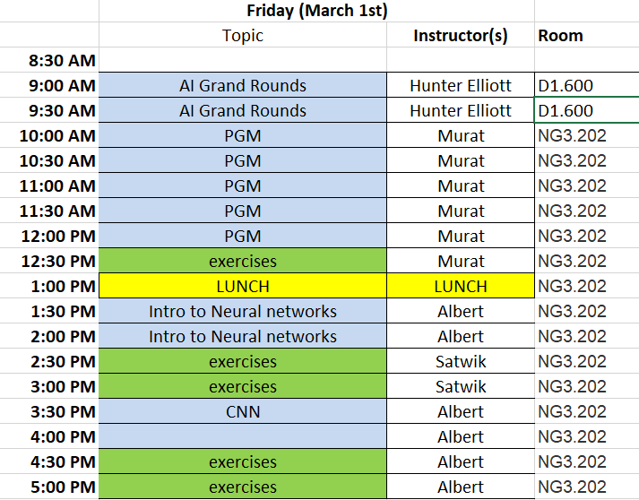

# [BICF](http://www.utsouthwestern.edu/labs/bioinformatics/) Machine Learning 1 - Nanocourse

Have you heard about machine learning and feel it may be of some value for your research?
This nanocourse will introduce machine learning from the ground up. No prior experience 
in machine learning is necessary. 

Topics for this two day (all-day) course will include:

- Intro to machine learning 
- Supervised learning including:
    - regression
    - classification 
- Regularization to handle overfitting
- Intro to neural networks
- Intro to convolutional neural networks for image analysis 
- Unsupervised learning including 
    - clustering
    - dimensionality reduction 
- Probabilistic graphical models (PGM)
    - fundamentals of the PGM formalism
    - representation with PGMs
    - learning model parameters
    - inference from the model

The course will be interactive, with lectures followed by hands-on learning and exercises.
Familiarity with basic programming/scripting concepts is assumed as is some prior programming experience in python.

You will not need to bring a laptop computer for this course. When you arrive you will loginto a prepared account on the BioHPC.

### Course Instructors:
- [Albert Montillo](mailto:Albert.Montillo@utsouthwestern.edu)
- [Satwik Rajaram](mailto:Satwik.Rajaram@UTSouthwestern.edu)
- [Murat Cobanoglu](mailto:Murat.Cobanoglu@UTSouthwestern.edu)  

### Course Administration: [Rebekah Craig](mailto:rebekah.craig@utsouthwestern.edu)

### Preparation for Class

- You only need to arrive on time. 
- The training accounts will be setup apprpriately for the interactive exercises. 
- If you with you may review how to use Jupyter notebooks, as these will be primarily used for the hands on portions of the course.
- Links
    - [Text-based tutorial of Jupyter notebooks](https://www.datacamp.com/community/tutorials/tutorial-jupyter-notebook)
    - [Video-based Jupyter Notebook Tutorial: Introduction, Setup and Walkthough](https://www.youtube.com/watch?v=HW29067qVWk)
 

# Schedule

Day 1  | **Feb 28th, 2019**  
Room NB2.100A

Day 2  | **March 1st, 2019**  
Room NG3.202

Probabilistic graphical models: [lecture](https://git.biohpc.swmed.edu/BICF/bicf_nanocourses/blob/master/courses/ML_1/lectures/PGM_talk.pdf), 
[exercise](https://git.biohpc.swmed.edu/BICF/bicf_nanocourses/blob/master/courses/ML_1/exercises/PGM.ipynb)

__TAs:__ 

## Additional Resources
Resources for the general course:
- [Offical Python Tutorial](https://docs.python.org/3/tutorial/)
- [Jupyter notebook Cheatsheet](https://s3.amazonaws.com/assets.datacamp.com/blog_assets/Jupyter_Notebook_Cheat_Sheet.pdf)

### Resources for the "probabilistic graphical models" unit:
Theory:
- [David Blei's "Foundations of Graphical Models" @ Columbia](http://www.cs.columbia.edu/~blei/fogm/2016F/)
- [Eric Xing's "Probabilistic Graphical Models" @ CMU](http://www.cs.cmu.edu/~epxing/Class/10708-14/lecture.html)

Probabilistic programming languages/packages for implementation:
- [STAN \[programming language\]](http://mc-stan.org/)
- [PyMC3 \[Theano-based package\]](http://docs.pymc.io/index.html)
- [Edward \[Tensorflow-based package\]](http://edwardlib.org/)