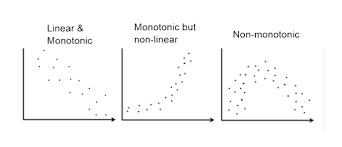

```{r setup, include=FALSE}
knitr::opts_chunk$set(echo = TRUE)
```

## Pearson Correlation
The Pearson correlation coefficient (r) is a measure of the linear correlation between two variables. In otherwords to tells how strong or weak the linear relationship between two variables is.

{width=150%}

- $-1 \le r \le 1$
    - r = 0: No linear association between the two variables. **CAREFUL! This does not imply independence.**
    - r = 1: There is a perfect positive linear association between the two variables.
    - r = -1: There is a perfect negative linear association between the two variables.
    
- Assumption: Both sample variables are drawn from normal distributions.
    - Test for Normality
    - Can be approximate for non-normal distributions but requires a large sample size.

- Hypothesis:
    - H0: $\rho$ = 0
    - H1: $\rho \ne$ 0
    
```{r}
data("mtcars")
plot(mtcars$wt, mtcars$mpg)
cor.test(mtcars$wt, mtcars$mpg)
cor.test(mtcars$wt, mtcars$mpg, "less")
```

The Pearson correlation test also returns a p-value that can be compared to a predetermined alpha value. Based on the results, there is enough statistical significance to conclude that the weight and mpg of a car have a relatively strong negative correlation.

What if the data is not linear? **Spearman Rank Correlation**  
{width=150%}

#### ***Correlation $\ne$ Causation***

## Linear Regression
Linear Regression is a method of modeling the relationship between two variables. Typically, this is when one variable is independent and the other is a response variable. Linear Regression is one of the most basic methods of relationship modeling because it attempts to describe the population relationship using a strait line.
$$Y = \beta_1x + \beta_0 + \epsilon$$
In this equation, $\beta_1$ is the slope of the line, $\beta_0$ is the y-intercept, and $\epsilon$ is the error. $\epsilon$ is not always listed or shown.

- Assumption: **LINE**
    - Linear relationship
    - Independent errors
    - Normally distributed errors
    - Equal residual variance (Homoscedasticity)

- Hypothesis:
    - H0: $\beta_0$ and $\beta_1$ are 0
    - H1: $\beta_0$ or $\beta_1$ are not 0

```{r}
data("cars")
scatter.smooth(x=cars$speed, y=cars$dist, main="Dist ~ Speed")
lr <- lm(dist ~ speed, data=cars)
lr
summary(lr)
abline(lr, col="red")
```

So how do we interpret these results? Like other tests, there is a p-value outputted which helps us either reject or fail to reject the null hypothesis. the lm() function also outputs the estimated values for $\beta_0$ and $\beta_1$ from this model. Finally, there is an R-squared value that is of importance to us. This is the residual-squared value which describes the amount of variation explained by this linear regression model. R-squared is a value between 0 and 1, 0 being no variance is explained and 1 being all the variance is explained.
