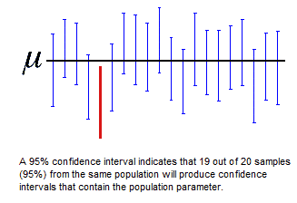
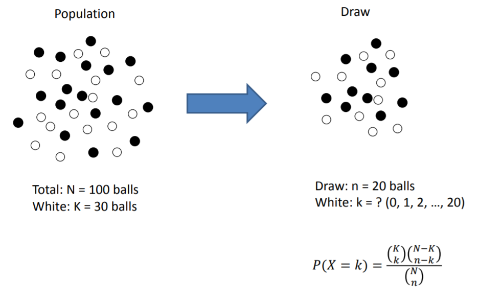
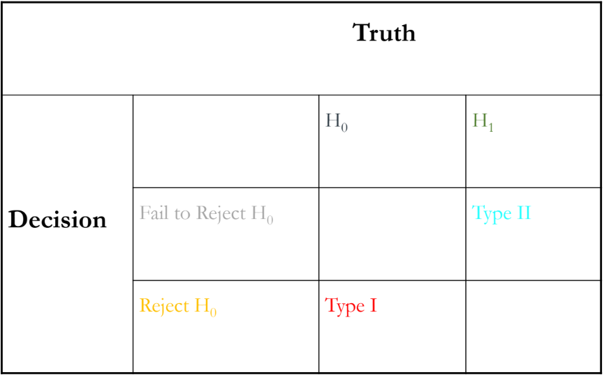

```{r setup, include=FALSE}
knitr::opts_chunk$set(echo = TRUE)
```

# Statistical Testing in R

## 5 general steps for statistical tests

1. **Formulate your hypothesis**

  - Null hypothesis (H0)
    - The commonly accepted fact
    - **The null hypothesis is generally assumed to be true until evidence indicates otherwise**
    - e.g. coin is fair (P = 0.5)
    - e.g. Cell count of culture treated with drug is the same as cell count of culture without treatment
  - Alternative hypothesis (H1)
    - The opposite of the null hypothesis
    - e.g. coin is not fair (P $\ne$ 0.5)
    - e.g. Cell count of culture treated with drug is different than cell count of culture without treatment

2. **Set $\alpha$ (or confidence level)**

  - $\alpha$ = 0.05 = False Positive
  - Confidence level = 1 - $\alpha$ = 0.95

3. **Calculate the test statistic**

  - Under the null hypothesis, we can calculate the test statistics
  - Construct the Confidence Interval from the test statistics
  - e.g. Number of heads, N, follows a binomial distribution with parameter P = 0.5
    - N ~ Binomial(6, 0.5)
  - Different Distributions
    - Bernoulli
    - Uniform
    - Binomial/Negative Binomial
    - Normal
    - Poisson
    - Exponential

4. **Run statistical test to estimate p-value**

  - P-value is the probability of observing the same or more extreme events as the current observation under null hypothesis
  - e.g. P-value = Prob(N $\leq$ 6) = 0.56 = 0.015625

5. **Interpret test results and draw a conclusion about null hypothesis**

  - Compare p-value with the threshold value
	  - e.g. 0.015625 < 0.05
  - Accept/reject the null hypothesis
	  - e.g. reject the null hypothesis (P = 0.5)
	  - At the $\alpha$=0.05 level, the coin is not fair
    - **Rejecting null hypothesis requires support from the data**


## Step 1 - Formulate your hypothesis

It is important to remember that your null hypothesis is the commonly accepted fact.

- Question: Is a dice fair?
    - H0: A Dice is not loaded
    - H1: A Dice is loaded.
- Question: Do sick patients show an increase in LDH levels?
    - H0: LDH levels in a healthy patient and a sick patient are the same.
    - H1: LDH levels in a sick patient are higher than the levels in a healthy patient.

## Step 2 - Set $\alpha$ (or confidence level)

$\alpha$ is a measure of the uncertainty allowed in an experiment. (False Positive)  
The confidence level is 1 - $\alpha$. The confidence level is the measure of certainty in an experiment.  

Picking a reasonable $\alpha$ is crucial for scientific standing. The most commonly used $\alpha$ values are 0.05 and 0.01.

When would a less stringent confidence level be acceptable?

  - DNA alignment of a chicken and a human.
  - Effect of shampoo on hair growth.
  - Whitening effect of toothpaste flavors.

When is a high confidence level needed?

  - Testing effect of a drug on the heart or brain.
  - Surgical implants and procedures.
  - functionality of safety equipment (Do airbags deploy when your car crashes?)
 
***Remember, with great power comes great responsibility!***  
Any $\alpha$ value can be selected bat you must be able to give an explanation as to why it was selected!


## Step 3 - Calculate the test statistic

The end goal of running experiments and doing tests is to find some truth about the whole population based on the samples we see. This is important because many times, taking a poll of the entire population is impossible. For example, what proportion of people in the U.S. have never had chicken pox? How would we as a class answer this question?

E(X) (mean) and Var(X) (variance) are two statistics that aid in the translation of sample characteristics to population truths. In order to calculate these values, first we must determine the distribution of our data.

#### **Bernoulli Distribution**

Bernoulli is the simplest of all the distributions. This is because Bernoulli distribution has only 2 outcomes, success (1) or failure (0). Each outcome has a specific probability of occurring, usually denoted as p (probability of success) and 1-p (probability of failure). *library(statip)*

- dbern(x, prob)
- pbern(q, prob)
- qbern(p, prob)
- rbern(n, prob)

**Characteristics of Bernoulli Distribution**

- There are only two possible outcomes.  
- There is only 1 trial.

$$E(X) = p$$
$$Var(X) = p(1-p)$$

**Examples of Bernoulli Distribution**

- Flipping a Coin for heads or tails  
- Is it going to rain or not rain today?  
- Whether a patient has cancer or does not have cancer


#### **Uniform Distribution**

In an uniform distribution, there can be many different possible outcomes. What makes it uniform is that all the outcomes have the same probability of occurring. Typically the smallest outcome is denoted as a and the largest is denoted as b.

- dunif(x, min=0, max=1)
- punif(q, min=0, max=1)
- qunif(p, min=0, max=1)
- runif(n, min=0, max=1)

```{r}
numcases <- 10000
min <- 1
max <- 6
x <- as.integer(runif(numcases,min,max+1))
hist(x,main=paste( numcases," roles of a single die"),breaks=seq(min-.5,max+.5,1))
```

**Characteristics of Uniform Distribution**

- Every outcome has an equal probability of occurring.

$$E(X) = \frac{a+b}{2}$$
$$Var(X) = \frac{(b-a)^2}{12}$$

**Examples of Uniform Distribution**  

- Rolling a fair dice.  
- Drawing a card from a standard deck.  

#### **Binomial Distribution**

A binomial distribution comes from an experiment with only two outcomes being repeated a number of times. The point of this distribution is to model the number of successes of an event in a set number of experiments. Another way of thinking about a Binomial Distribution is a Bernoulli distribution that is repeated multiple times. The probabilities of success and failure for each trial are denoted the same as in the Bernoulli distribution. The number of trials performed is typically denoted as n.

- dbinom(x, size, prob)
- pbinom(q, size, prob)
- qbinom(p, size, prob)
- rbinom(n, size, prob)

```{r}
x <- seq(0,50,by=1)
y1 <- dbinom(x,50,0.2)
plot(x,y1)
y2 <- dbinom(x,50,0.5)
plot(x,y2)
```

**Characteristics of Binomial Distribution**  

- Each trial is independent.  
- Each trial can have only two possible outcomes.  
- All trials are identical.  
- The number of trials is a set value.

$$E(X) = n*p$$
$$Var(X) = n*p*1-p$$

**Examples of Binomial Distribution**

- If a coin is flipped 100 times, how many times is it expected to land on heads?  
- If blood test is run on a patient, how many of the tests will come back negative?

#### **Negative Binomial Distribution**

The negative binomial distribution is used to describe the number of trials before a certain number of successes. Unlike the binomial distribution, where the number of experiments is set, negative binomial will continue experiments until a set number of successes occurs. This distribution is denoted the same as Binomial with the addition of the number of successes (r).

- dnbinom(x, size, prob, mu)
- pnbinom(q, size, prob, mu)
- qnbinom(p, size, prob, mu)
- rnbinom(n, size, prob, mu)

```{r}
x1 <- rnbinom(500, mu = 4, size = 1)
h1 <- hist(x1, breaks = 20)
```

**Characteristics of Negative Binomial Distribution**

- Each trial is independent.  
- Each trial can have only two possible outcomes.  
- All trials are identical.  
- The number of successes is a set value.

$$E(X) = \frac{rp}{1-p}$$
$$Var(X) = \frac{rp}{(1-p)^2}$$

**Examples of Negative Binomial Distribution**

- How many times should you flip a coin to get 5 heads?  
- How many blood tests need to be run before a positive result comes back?
- RNAseq!!!

#### **Normal Distribution**

As its name suggests, the normal distribution is considered the "norm" for most things. Many occurrences in the universe fall into a normal distribution.

- dnorm(x, mean, sd)
- pnorm(q, mean, sd)
- qnorm(p, mean, sd)
- rnorm(n, mean, sd)

```{r}
x<-rnorm(10000,mean=0, sd=1)
hist(x,breaks=100,xlim=c(-5,5),freq=FALSE)

x<-rnorm(100,mean=0, sd=1)
hist(x,breaks=10,xlim=c(-5,5),freq=FALSE)
```

**Characteristics of Normal Distribution**

- Mean, median, and mode of the data are the same.
- Data follows a bell-curve.  
- Data distribution is symmetrical about the mean.

$$E(X) = \mu$$
$$Var(X) = \sigma^2$$

**Examples of Normal Distribution**

- IQ scores  
- Heights of people  
- Sum of rolling 2 dice (House always wins)  
- Birth weights  
- Shoe size  
- Academic performance of students at UTSW

#### **Poisson Distribution**

The Poisson distribution is used to describe the number of occurrences of an events in a an interval (time period or space). Specifically, it is used when events occur at random points in time.

- dpois(x, lambda)
- ppois(q, lambda)
- qpois(p, lambda)
- rpois(n, lambda)

```{r}
x <- 0:20
y <- dpois( x=0:20, lambda=6 )
plot(x, y, xlim=c(-2,20))
```

**Characteristics of Poisson Distribution**

- All events are independent of each other.  
- Probability of a successful event is the same, irrelevant of interval length.  
- As an interval length becomes smaller, the probability of success approaches 0.

$$E(X) = \mu$$
$$Var(X) = \mu$$

**Examples of Poisson Distribution**

- The number of 911 calls to a hospital in a single day.  
- The number of deaths in a specific city.  
- The number of dead cells in a specific tissue sample.  
- The number of cell divisions in a 1 hour interval.

#### **Exponential Distribution**

This distribution can be looked at as the reciprocal of Poisson distribution. The exponential distribution is used to model the interval between events. Most commonly, this distribution is used for survival analysis. To calculate these statistics, the failure rate ($\lambda$) is needed. This is described as the rate of failure at a certain point in time.

- dexp(x, rate)
- pexp(q, rate)
- qexp(p, rate)
- rexp(n, rate)

```{r}
hist(rexp(100))
hist(rexp(10000))
```

**Characteristics of Exponential Distribution**

- A failure rate must be available.  
- There must be distinct events that can be separated by time intervals.

$$E(X) = \frac{1}{\lambda}$$
$$Var(X) = (\frac{1}{\lambda})^2$$

**Examples of Exponential Distribution**

- The length of time between UTSW bus arrivals.  
- The life expectancy of a bacterium.  
- The rate of drug availability in the body.

#### **Other Distributions in R**

The Distributions listed above are not the only distributions that can be seen in experiments. Every distribution in R has 4 functions.

- p = probability: the cumulative distribution function (CDF)
- q = quantile: the inverse CDF
- d = density: the density function (PDF)
- r = random: a random variable having the specified distribution 

Below is a table of the different distributions and their functions.
```{r, echo=FALSE}
Distribution <- c("Beta","Binomial","Cauchy","Chi-Square","Exponential","F","Gamma","Geometric","Hypergeometric","Logistic","Log Normal","Negative Binomial","Normal","Poisson","Student t","Studentized Range","Uniform","Weibull","Wilcoxon Rank Sum Statistic","Wilcoxon Signed Rank Statistic")
pFunction <- c("pbeta","pbinom","pcauchy","pchisq","pexp","pf","pgamma","pgeom","phyper","plogis","plnorm","pnbinom","pnorm","ppois","pt","ptukey","punif","pweibull","pwilcox","psignrank")
qFunction <- c("qbeta","qbinom","qcauchy","qchisq","qexp","qf","qgamma","qgeom","qhyper","qlogis","qlnorm","qnbinom","qnorm","qpois","qt","qtukey","qunif","qweibull","qwilcox","qsignrank")
dFunction <- c("dbeta","dbinom","dcauchy","dchisq","dexp","df","dgamma","dgeom","dhyper","dlogis","dlnorm","dnbinom","dnorm","dpois","dt","dtukey","dunif","dweibull","dwilcox","dsignrank")
rFunction <- c("rbeta","rbinom","rcauchy","rchisq","rexp","rf","rgamma","rgeom","rhyper","rlogis","rlnorm","rnbinom","rnorm","rpois","rt","rtukey","runif","rweibull","rwilcox","rsignrank")
noquote(cbind(Distribution,pFunction,dFunction,rFunction))
```

### Confidence Interval

Confidence interval is based on the confidence level (1 - $\alpha$) and is determined using the test statistics. For each sample, a mean is calculated that is supposed to represent the mean of the population. But, because this does not use the entire population, it is not perfect.  

For example, what proportion of people in the U.S. have never had chicken pox? If we took a sample of the population, we cannot expect that the proportion of never having chicken pox in this sample is the exact same as the population's proportion. So, we build a confidence interval using the variance and means of the sample.  

In a normal distribution, a 95% confidence interval is $\mu\pm1.96$ standard deviations. 99% confidence interval is $\mu\pm2.576$.
A confidence interval means that there is a 95% chance that the range of $\mu\pm1.96$ standard deviations of the sample will contain the true mean of the population. Another way to say this if we take many random samples and find their confidence intervals, it can be expected that 95% of these intervals will contain the true mean of the population.  

{width=150%}

## Step 4 - Run statistical test to estimate p-value

The same way that samples can be described using different distributions, different hypothesis can be tested using different statistical tests. The hardest part of any statistical problem is determining the best test to use in order to truly answer the question posed by the hypothesis. **If you can select the right statistical test, then you have already finished the hardest part.**

The first question that needs to be asked is whether we should run a one-sided or two-sided test. The sides refer to where on our distribution we are assigning the $\alpha$ value or false positive.

- one-sided test
    - All the false positives come from one side of the distribution.  
    - Used when we only care about the effect in one direction. 
    - Examples  
        - A new drug is developed that is cheaper than the existing drug. Is the new drug no less effective than the old drug?   
        - Is the average temperature in Dallas colder than the average temperature in Austin?  
        - Is taking the toll road to work faster than avoiding the toll?
        - Is the cell count of a bacterium culture treated with anti-bacteria less than the cell count of an untreated culture?  What about a culture that has resistance to the anti-bacterium?
    - **Clues to look for**
        - H1: $\mu$ < 0
        - H1: $\mu$ > 0
    
- two-sided test
    - The false positives are split onto either side of the distribution ($\frac{\alpha}{2}$ in each tail).
    - We care about an effect in both directions in this case.
    - Examples
        - Does Carbidopa have an effect on Levodopa's ability to combat Parkinson's symptoms.
        - The cost of health care in Texas is the same as the cost in California.
        - Is the weight of a group of mice equal to 45g?
    - **Clues to look for**
        - H1: $\mu \ne 0$

- **Do NOT choose 1 sided because:**
    - Choosing a one-sided test for the sole purpose of attaining significance.
    - Choosing a one-sided test after running a two-tailed test that failed to reject the null hypothesis.

#### **t-test**

- One-sample t-test
    - whether the mean of a population has a value specified in a null hypothesis
    - e.g. whether the mean weight of a group of mice is equal to 45g
    - H0: $\mu$ = 45g
- Two-sample test
    - whether the means of two populations are equal
    - e.g. whether the mean weight of two groups of mice are equal.
    - H0: $\mu_1 = \mu_2$
- Two-sample paired test
    - the difference between two responses measured on the same statistical unit has a mean value of zero
    - e.g. for the same group of mice, whether the mean weight changed after a treatment.
    - H0: $\Delta\mu = 0$
- Test of beta in regression
    - whether the slope of a regression line differs significantly from 0
- Assumptions
    - Continuous Variable
    - Independence
    - Normality
    - Homogeneous (Same population variances)
- Example: Is there significant difference in LDL levels between men and women?
    - H0: Difference between LDL levels in men and women are 0
    - H1: Difference between LDL levels in men and women are not 0

```{r}
data("airquality") #New York Air Quality Measurements
temp <- airquality$Temp
t.test(temp, mu = 75)

data("sleep") #Student's Sleep Data
g1 <- sleep[which(sleep$group==1),]
g2 <- sleep[which(sleep$group==2),]
t.test(g1$extra,g2$extra)
```
#### **Test for Normality**

- Compare data to normal distribution ($\alpha$ > 0.05)
- Shapiro-Wilk test (preferred)
    - Higher power than K-S test
- Kolmogorov-Smirnov test
    - High sensitivity to extreme values
    - Low power

- **Can be sensitive to sample size so USE WITH CAUTION**

What if there are more than 2 samples to be tested? or multiple groups to be compared?
Why wont multiple t-tests work?

#### **Analysis of Variance test (ANOVA)**

- e.g. compare MCAT scores of students from different countries.

n-way ANOVA tests allow for the testing of multiple different means at once.  
H0: all sample means are the same ($\mu_1 = \mu_2 = ... = \mu_n$)  
H1: all sample means are not the same **...problems???**

```{r}
data("iris")
setosa <- iris[which(iris$Species=='setosa'),]
versicolor <- iris[which(iris$Species=='versicolor'),]
virginica <- iris[which(iris$Species=='virginica'),]

aov(Petal.Length ~ Species, data = iris)
summary(aov(Petal.Length ~ Species, data = iris))
```

- Examples
    - Information on 6 drugs, each with 3 different delivery methods, was collected from UTSW. Which drug with a specific delivery method had the best effect on patients?
    -  A study is designed to test whether there is a difference in mean daily calcium intake in adults with normal bone density, adults with osteopenia and adults with osteoporosis. Each participant's daily calcium intake is measured based on reported food intake and supplements.


#### **Wilcoxon Rank-Sum test**

- Non-parametric test
    - Not based on parameterized families of probability distributions
    - it does not require the assumption of normal distributions
- Alternative to the two-sample t-test
- Other names
    - Mann-Whitney U test
    - Mann-Whitney-Wilcoxon (MWW)
    - Wilcoxon-Mann-Whitney test
- Assumptions
    - Independence
    - Responses are Ordinal (two observations can be separated into greater and less than)
- Example: Is there significant difference in LDL levels between men and women?
    - H0: Difference between LDL levels in men and women is 0
    - H1: Difference between LDL levels in men and women is not 0

```{r}
data("airquality") #New York Air Quality Measurements
temp <- airquality$Temp
wilcox.test(temp, mu = 75)

data("sleep") #Student's Sleep Data
g1 <- sleep[which(sleep$group==1),]
g2 <- sleep[which(sleep$group==2),]
wilcox.test(g1$extra,g2$extra)
```

#### **Hypergeometric Test**

- Hypergeometric test can be used in enrichment test.
- Hypergeometric Distribution
    - Discrete probability distribution
    - Describe the probability of k successes in n draws, without replacement, from a finite population of size N that contains exactly K successes, wherein each draw is either a success or a failure. 
    

    
- Experiment (e.g. RNA-seq to identify deferentially expressed genes)
    - 20,000 (N) genes were assayed
    - 100 (K) genes were from Pathway A
    - 150 (n) deferentially expressed genes were identified
    - 20 (k) deferentially expressed genes were from Pathway A
- Question: Are the genes from Pathway A significantly enriched in the deferentially expressed genes?
- Hypothesis
    - H0: Genes from Pathway A were not enriched
    - H1: Genes from Pathway A were enriched
- Calculation of P-value
    - P-value = P(X=20) + P(X=21) + . + P(X= 150)


#### **Fisher's Exact test**

- The test is useful for categorical data that result from classifying objects in two different ways.
- Examine the association (contingency) between the two kinds of classification.
- Example: Is there association between gender and cardiovascular disease (CAD)?
- Hypothesis
    - H0: There is no association between gender and CAD
    - H1: There is association between gender and CAD
- Odds Ratio


#### **Multiple Testing Corrections**

When it comes to biology, the number of tests run influences the results. In RNAseq, thousands of t-tests are run. The error of these tests compound over time.

- Bonferroni Correction
    - adjusts the p-value to account for the compounded error.
    - more stringent
    - e.g. if 20 t-tests are run with $\alpha$ = 0.05, Bonferroni will will be over conservative and adjust to 0.0025.
- False Discovery Rate
    - FDR controls the proportion of false positives in all statistically significant results.
    - less stringent


## Step 5 - Interpret test results and draw a conclusion about null hypothesis

Statistical tests return a p-value, but what is does this value mean?


#### **p-value**

- probability of obtaining the observed results of the experiment.
- NOT error rate
- Compare p-value with the threshold value ($\alpha$)
    - remember $\alpha$ is the false positive proportion which gives us the confidence interval
	  - e.g. 0.015625 < 0.05
- Accept/reject the null hypothesis
    - If p-value < $\alpha$, there is enough statistical significance to reject the null hypothesis.
    - If p-value $\ge \alpha$, we fail to reject the null hypothesis.
    - **PAY ATTENTION TO WORDING**
    - e.g. reject the null hypothesis (P = 0.5)
    - At the ??=0.05 level, the coin is not fair?

*But does this information carry over to the truth about the entire population we seek?*  
If the p-value is significant, then either the alternative hypothesis is true, or the null hypohtesis is true and we simply happened to observe the experiment data by chance.  

- Examples
    - The coin is fair but we just got "lucky".
    - An observed cell count of treated culture and untreated culture return a p-value less than $\alpha$.

What can we do to achieve certainty? (Hint: Scientific Theory) Thats why its called REsearch!


#### **Power and Errors**

- Type I error = False positive = $\alpha$
    - This occurs when H0 is the actual truth, but our statistical test results show a rejection of H0.
    - RNAseq gene shows statistical significance between group 1 and group 2 when there is no difference.
- Type II error = False Negative = $\beta$
    - This occurs when H0 is actually false, but our statistical test results fail H0.
    - RNAseq gene shows no difference in group 1 and group 2 when there is a difference.
- Power = $\pi$ = $1 - \beta$
    - This is the opposite of type II error. The power of a test refers to when H0 is actually false and our statistical test results show that H0 is rejected.
    - *Remember the tests for Normality*



#### **Bayesian Statistics**

- Mathematical procedure to solve statistical problems using probability.

e.g. What is the lilikelihood that a child is born with a rare disease?  
Now what if i told you that both the mother and father are carriers for the rare disease.  
We would want to say there is now a higher chance that the child has a rare disease. But how do we prove that?

Bayes Rule and bayesian statistics allow us to alter our predictions based on new information. The basis of bayesian statistics is that likelihood of an event can change based on new information that is introduced.

- Examples:
    - What is the chance you will need a winter coat tomorrow? vs What is the chance given that we know it is June?
    - What is the probability of seeing the sequence AAGACTGTC?
