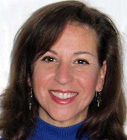

# [BICF](http://www.utsouthwestern.edu/labs/bioinformatics/) NCBI Workshops presented by the NIH

The Bioinformatics Core Faculity at UTSW is offering a series of training sessions conducted by Drs, Peter Cooper, Rana Morris, Sherri Holland Bailey and Wayne Matten, from the NCBI.

These four independent workshops provide hands-on training in using NCBI resources. They’ve designed these workshops with task-specific exercises and encourage you to sign up for the one or ones that directly apply to your own research efforts.
The four workshops will be:
* Microbiology Research
* Genetic Disease Discovery and Clinical Support
* Genetic Variation and Gene Expression Research
* Creating NIH Biosketches and Complying with the NIH Public Access Policy

## Contacts
* Course Coordinator [Brandi Cantarel](mailto:brandi.cantarel@utsouthwestern.edu)
* Course Administration [Rebekah Craig](mailto:rebekah.craig@utsouthwestern.edu)

## Computer Requirements

**Please bring a WiFi-enabled laptop computer to fully participate in the workshops.**

In order to do some of the expercises in the two morning sessions you might want to install edirect onto your computer. 
By the following methods:

* Download [VirtualBox](https://www.virtualbox.org/)
* Import this [VM](https://cloud.biohpc.swmed.edu/index.php/s/DNWEZjqSC0gqJcv) with **edirect already installed**
* Login user password = Ncb1n@n0 
 
OR

* Windowns ios users will need to install the required dependencies using with these [instructions](cgwin.md)
* Mac Users might have to install Developer tools if not already installed
* Install edirect on their computers using these [instructions](https://dataguide.nlm.nih.gov/edirect/install.html#edirect-installation)

## Schedule
| Time  | Topic | Instructor| Location |
| ------------- | ------------- | ------------- |------------- |
| | March 28th, 2018| | |
| 9:00 a.m. - 12:00 p.m. | [Microbiology Research](ftp://ftp.ncbi.nlm.nih.gov/pub/education/Mod_Workshops/2018/UTSW_March/Microbiology_Resources/) | Peter Cooper | NG3.112 |
| 1:00 p.m. - 4:00 p.m. | [Genetic Disease Discovery and Clinical Support](ftp://ftp.ncbi.nlm.nih.gov/pub/education/Mod_Workshops/2018/UTSW_March/ClinicalGenetics_Resources/)| Rana Morris, PhD | NG3.112 |
| 4:30 p.m. - 5:30 p.m. | Focus Group for Researchers | | NG3.104|
| | March 29th, 2018| | |
| 9:00 a.m. - 12:00 p.m. | [Genetic Variation and Gene Expression Research](ftp://ftp.ncbi.nlm.nih.gov/pub/education/Mod_Workshops/2018/UTSW_March/HumanGenomics_Resources/) | Wayne Matten, PhD | NG3.112 |
| 1:00 p.m. - 4:00 p.m. | [Creating NIH Biosketches and Complying with the NIH Public Access Policy](ftp://ftp.ncbi.nlm.nih.gov/pub/education/Mod_Workshops/2018/UTSW_March/NIHGrant_Resources/)| Sherri Holland Bailey, M.L.I.S. | NG3.112 |
| 4:30 p.m. - 5:30 p.m. | Focus Group for NIH Grantees and Clinicians | | NG3.104|

### NCBI Resources for Microbiology Research

Wednesday March 28th, 2018 9am - 12pm

* [Lecture and Workbooks](ftp://ftp.ncbi.nlm.nih.gov/pub/education/Mod_Workshops/2018/UTSW_March/Microbiology_Resources/General/)
* [Edirect Resources](ftp://ftp.ncbi.nlm.nih.gov/pub/education/Mod_Workshops/2018/UTSW_March/Microbiology_Resources/Commandline_Tools/)

This workshop is most useful for researchers who use bacterial sequence data, including those of human pathogens or microbial communities including microbiomes. 
In this workshop you will learn how to:
* Find, browse and download genome-, gene-, protein- and nucleotide sequence read-level data for individual bacterial pathogens and metagenomes
* Access and display precomputed genome analyses and perform your own analyses of assembled and unassembled genomic data to identify organisms and genes
* Find, display and analyze microarray and sequence-based (RNA-Seq) data to investigate gene expression
* Find variants, antibiotic resistance genes and pathogenicity factors using genome- and SRA-BLAST.

The workshop ends with an optional session, where we will demonstrate command-line tools (EDirect, standalone Magic-BLAST and SRA-toolkit) that can help you to retrieve data and perform analyses of microbial data. This command-line tools session assumes a basic knowledge of the Unix/Linux environment.
 
 
Peter Cooper, Ph.D. is an NCBI Customer Experience team member and Team Lead for Strategic Communications (Education, Social Media, Conferences). For the past 20 years, he has provided user support for the NCBI molecular databases and tools and has directed scientific education and outreach efforts including popular courses and workshops such as the long-running NCBI Field Guide, Discovery Workshops and Modular Workshops and numerous short courses at Cold Spring Harbor Laboratories, the Jackson Laboratory and Woods Hole Hole Oceanographic Institution. He has research experience in biochemistry and marine biology.

### NCBI Resources for Genetic Disease Discovery and Clinical Support

Wednesday March 28th, 2018 1pm - 4pm

* [Lecture](ftp://ftp.ncbi.nlm.nih.gov/pub/education/Mod_Workshops/2018/UTSW_March/ClinicalGenetics_Resources/Slides_ClinicalGenetics.pptx)
* [Workbook](ftp://ftp.ncbi.nlm.nih.gov/pub/education/Mod_Workshops/2018/UTSW_March/ClinicalGenetics_Resources/Workbook_ClinicalGenetics.pdf)
* [Course Resources](ftp://ftp.ncbi.nlm.nih.gov/pub/education/Mod_Workshops/2018/UTSW_March/ClinicalGenetics_Resources/)

The use of genetic testing in patient care is becoming more common in clinical practice. NCBI has long had resources for biologists to explore what is known about genetic variation, but has recently developed clinically-focused resources. This module is designed for those involved in clinical practice and/or translational research.
 
Based on a real-world case study, you will learn how to:
* Find a MedGen record with links to various literature resources to assist in clinical decision support and patient education
* Identify a relevant diagnostic genetic test and examine sample test results
* Based an identified genetic variant, explore the affected gene and gene product with regard to structure and function
* Explain the patient's disease etiology and effectiveness of therapeutic interventions

This module ends with a session where you will be given your own case study to solve.
 
 
Rana Morris, Ph.D. is an NCBI Customer Experience team member and Team Lead for Educational Programs (Courses/Workshops, Webinars, Educational Materials). Since 2002, she has provided user support and training, as well as working with supervisors and development teams to improve NCBI resources based on user-centered design principles. Her doctoral, post-doctoral and research fellowship work integrated disciplines of computational and experimental biochemistry, molecular and cellular biology and genetics, and has included diagnostic development, drug design and coordination of genetics/genomics components of clinical trials.

### NCBI Resources for Genetic Variation and Gene Expression Research

Thursday March 29th, 9am-12pm

* [Lecture](ftp://ftp.ncbi.nlm.nih.gov/pub/education/Mod_Workshops/2018/UTSW_March/HumanGenomics_Resources/Slides_HumanVariationExpression.pptx)
* [Workbook](ftp://ftp.ncbi.nlm.nih.gov/pub/education/Mod_Workshops/2018/UTSW_March/HumanGenomics_Resources/Workbook_HumanVariationExpression.pdf)
* [EDirect](ftp://ftp.ncbi.nlm.nih.gov/pub/education/Mod_Workshops/2018/UTSW_March/HumanGenomics_Resources/Workbook_EDirect.txt)
* [Course Resources](ftp://ftp.ncbi.nlm.nih.gov/pub/education/Mod_Workshops/2018/UTSW_March/HumanGenomics_Resources/)

This module is for those involved in genetic variation research, and it briefly touches on gene expression resources. The module focuses on human data, but the exercises generally apply to other model eukaryotic organisms.
In this workshop you will learn how to:
* Find, view and download genomic sequence and annotation data
* Identify and view variants within a gene or genomic region, as well as variants associated with a given disease or phenotype using several NCBI variation resources
* Find and download gene expression studies with data from the GEO and SRA databases

This module ends with an optional session where we will demonstrate the command-line tools EDirect (for downloading data from NCBI databases) and SRA Toolkit (for downloading and analyzing RNA-seq and DNA-seq data). This command-line tools session assumes a basic knowledge of the Unix/Linux environment.

 
Wayne Matten, Ph.D. is an NCBI Customer Experience team member and Team Lead for a new NCBI program in Market Research. Since2000, he has provided user support including teaching courses and workshops on a wide range of NCBI resources. Wayne also maintains the NCBINLM YouTube channel and creates short, tutorial videos on NCBI tools and resources. His research background is in biochemistry/molecular biology focused on signal transduction mechanisms involving oncogenes.

### NCBI Resources for Creating NIH Biosketches and Complying with the NIH Public Access Policy

Thursday March 29th, 2018 1pm-4pm

* [Lecture](ftp://ftp.ncbi.nlm.nih.gov/pub/education/Mod_Workshops/2018/UTSW_March/NIHGrant_Resources/Slides_MyNCBIforNIHGranting.pptx)
* [Workshop](ftp://ftp.ncbi.nlm.nih.gov/pub/education/Mod_Workshops/2018/UTSW_March/NIHGrant_Resources/Workbook_MyNCBIforNIHGranting.pdf)

NIH supports scientists at various stages in their careers from pre-doctoral students to new- and early-career scientists with research training grants to investigators with extensive experience who run large research centers. NCBI has created an account system with My NCBI tools to assist researchers and their delegated staff with preparation of federal grant proposals and for NIH-funded grant progress reporting.
 
In this workshop you will learn how to:
* Create and efficiently use an NCBI account
* Generate a My Bibliography reference list and a SciENcv biosketch for grant proposal submissions
* Learn how to comply with the NIH Public Access Policy and manage Public Access compliance and NIH grant progress reporting

The second half of this workshop is an optional hands-on session where you can get hands-on experience with the tools with instructor-guided exercises.

 
Sherri Holland Bailey, M.L.I.S. is an NCBI Customer Experience team member specializing in assisting customers with NCBI Accounts and My NCBI, as well as PubMed Central (PMC).  She has over 15 years of library and training experience working with professors, students, teachers and state officials in academia, public school systems, and public and government libraries.  

